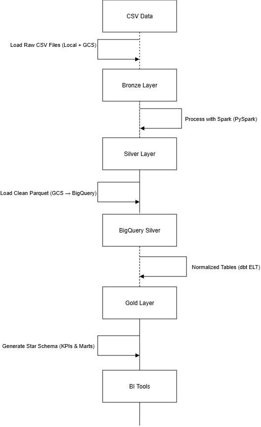

# 🛒 E-commerce Analytics Platform

This project implements a production-style end-to-end ELT pipeline for e-commerce analytics.
Raw transactional data is ingested, transformed with Spark, modeled with dbt, and orchestrated with Airflow to produce analytics-ready star-schema tables in BigQuery.

## 🎯 Objectives

- Build a modern ELT pipeline
- Apply dimensional modeling (Star Schema)
- Implement incremental data processing
- Enable analytics-ready KPIs
- Orchestrate end-to-end workflow using Apache Airflow

## ⚙️ Tech Stack
__________________________________________________________
| Layer           | Technology                            |
| --------------- | --------------------------------------|
| Ingestion       | Python (CSV ingestion)                |
| Storage         | Local FS → GCS - Google Cloud Storage |
| Processing      | PySpark                               |
| Warehouse       | BigQuery                              |
| Transformations | dbt                                   |
| Orchestration   | Airflow (design-ready)                |
| Analytics       | SQL / BI tools (Power BI)             |
|_________________|_______________________________________|

## 🧱 Data Layers
- **Bronze**: Raw CSV files ingested from source systems, append-only
- **Silver**: Cleaned, deduplicated, and normalized data via PySpark, stored as Parquet
- **Gold**: Cleaned, deduplicated, and normalized data via PySpark, stored as Parquet

## 🏗 Architecture

    🥉 Bronze Layer
        - Raw CSV files
        - No transformations
        - Append-only

    🥈 Silver Layer
        - PySpark transformations
        - Deduplication & normalization
        - Stored as Parquet
        - Incremental-ready

    🥇 Gold Layer
        - Star schema (facts & dimensions)
        - dbt incremental models
        - Analytics marts for KPIs

    📊 Key KPIs
        - Revenue
        - Average Order Value (AOV)
        - Customer Retention
        - On-time Delivery Rate
        - Product & Category Performance

  

## 📂 Repository Structure (soon)

## ✅ Data Quality

    - dbt tests (not null, uniqueness)
    - Revenue and KPI reconciliation
    - Referential integrity checks
    - Incremental model validation

## 🚫 Data Policy
This repository does not include raw data. Only sample CSV, schemas, transformations, and documentation are included.

Large datasets should be sourced from your internal storage or GCS bucket.

## 🚀 How to Run

    # Run Spark transformations
        spark-submit spark/silver_transformations.ipynb
    # Run dbt models
        dbt run
        dbt test
    # Run airflow
        airflow db init
        airflow scheduler
        airflow webserver
## Power BI Dashboard - Sales Overview

-KPIs: Total Revenue , Total Orders , Average Order Value
-Time-based analysis
- Customer segmentation insights
